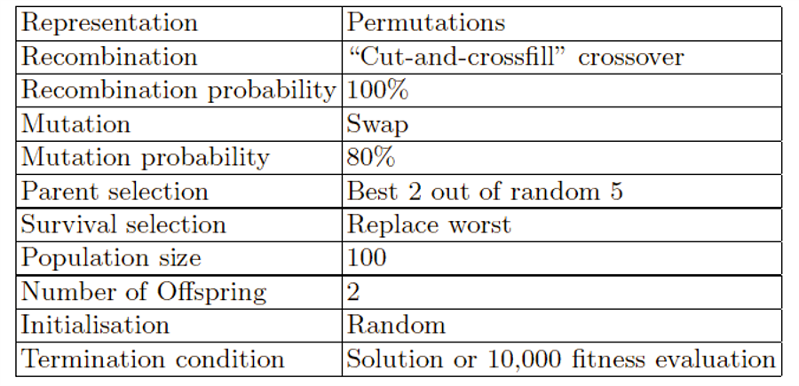
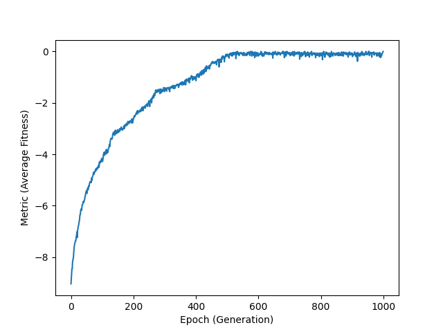

# N-Queens :: Genetic Algorithm

Solving N-Queens problem by Simple Genetic Algorithm in Python.

> From the [Introduction to Evolutionary Computing](http://www.evolutionarycomputation.org/) book

### Algorithm Summary

### Demo

### Usage

- `git clone <url> nqueens`
- `cd nqueens`
- `python -m venv .venv`
- `./.venv/Scripts/activate`
- `pip install poetry`
- `poetry install`
- `poetry run main`
